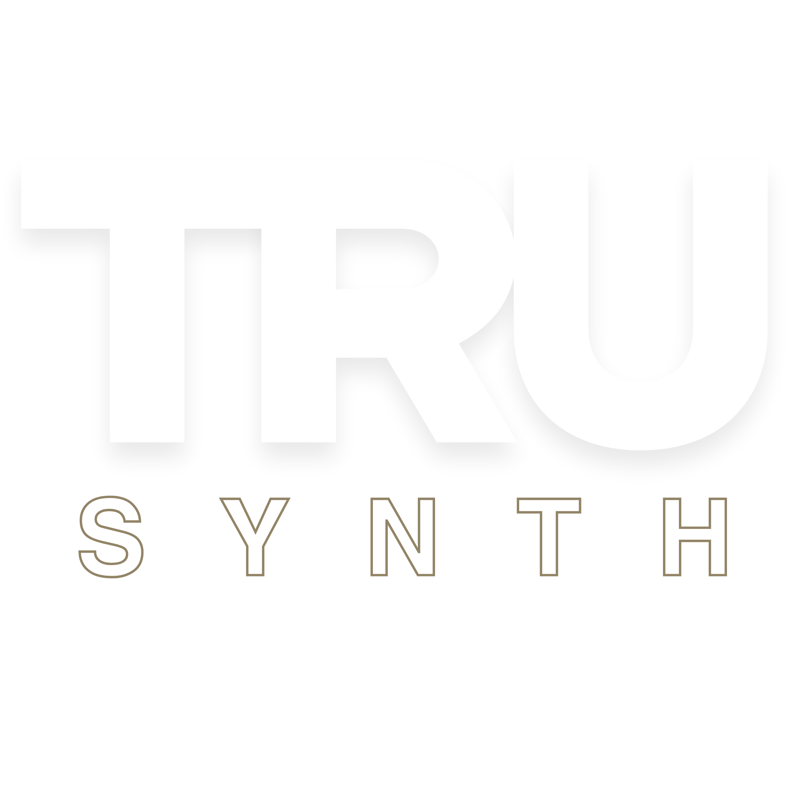
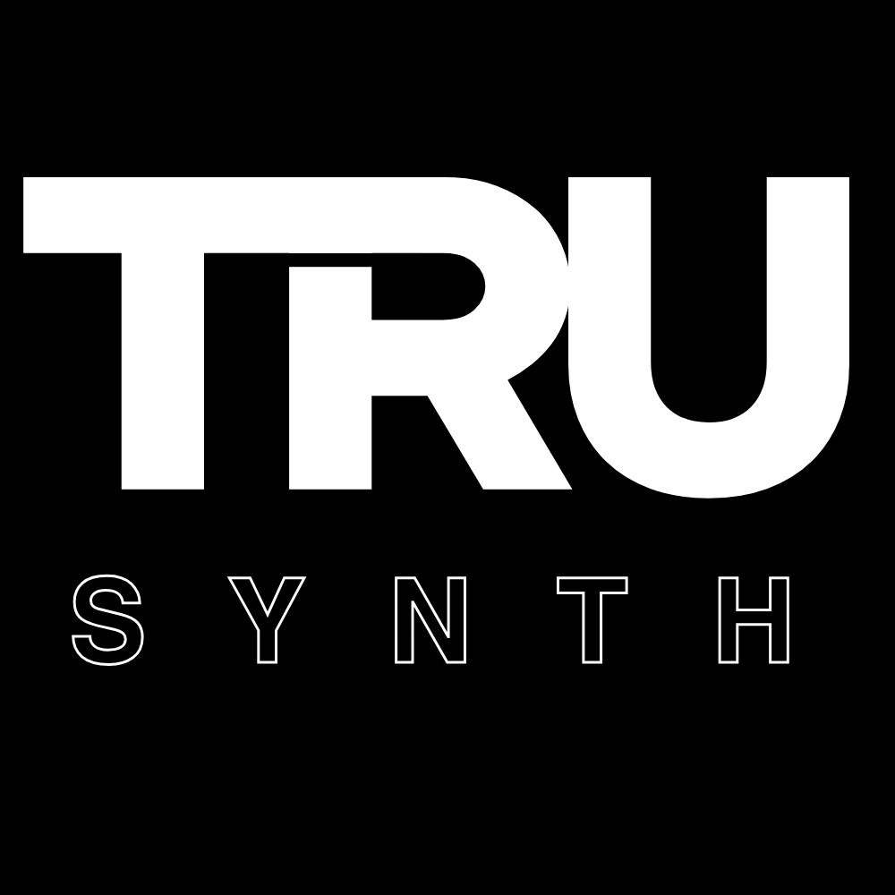
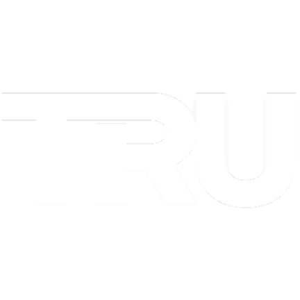
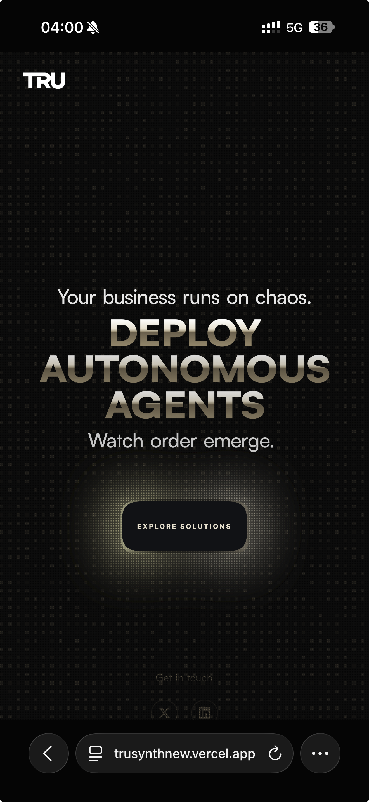

<div align="center">



# TRU SYNTH — Brand Kit

**Obsidian & Gold** — autonomous agent infrastructure for enterprise operations.

[](https://trusynth.com)
[](code-reference/)
[](00-QUICKSTART.md)

</div>

---

## What this is

A drop-in brand kit for TRU SYNTH. Designed as the single upload for [Claude's design-system configurator](https://claude.ai/design) — plug the repo URL in, or drag the folder.

Contains logos, icons, hero imagery, the official brand kit PDF, a slim snapshot of the production codebase, and five reference docs with colors, fonts, tokens, and component recipes.

---

## Company blurb

> **TRU SYNTH | Intelligent Solutions** — we architect agentic operating systems for the next generation of autonomous enterprise.

**Hero:** *THE FOUNDATION OF INTELLIGENCE.* Your one-stop shop for advanced AI solutions.

**Dashboard:** *WE BUILD AGENTIC OPERATING SYSTEMS / TOOLS FOR…*

### The four pillars (each is a named OS)

| Pillar | System | Theme | OS for… |
|---|---|---|---|
| 🏛 **Institutions** | **ALPHA** | Dark | Capital Allocation |
| 🌐 **Governments** | **COMMAND** | Light | Sovereign Operations |
| ⚡ **Enterprise** | **VELOCITY** | Gold | Agentic Operations |
| 🔩 **Assets** | **FOUNDRY** | Foundry | Plug & Play Resources — Claude skills, UI kits, agents |

### Underneath: the runtime

Beneath all four pillars runs **Jellyclaw** — our open-source, MIT-licensed Claude Code replacement. A transparent TypeScript agent runtime that engineers can read, audit, and embed. *"Same tools, same schema, your infra."*

| Surface | What it is |
|---|---|
| **Jellyclaw** | The engine — CLI · TUI · HTTP server · library (npm / Homebrew / Docker) |
| **Genie** | CLI agent dispatcher built on Jellyclaw |
| **jelly-claw** | macOS video-calling app with in-call AI voice triggers |

**Tagline:** *Your agents don't clock out.*

---

## The palette — "Obsidian & Gold"

<table>
<tr>
<td align="center" width="140">


<br>**Primary Black**
<br>`#050505`

</td>
<td align="center" width="140">


<br>**Elevated Black**
<br>`#0a0a0a`

</td>
<td align="center" width="140">


<br>**Signature Gold**
<br>`#928466`

</td>
<td align="center" width="140">


<br>**Highlight Gold**
<br>`#E8E0CC`

</td>
<td align="center" width="140">


<br>**Dark Gold**
<br>`#6d6350`

</td>
</tr>
</table>

**Rule:** gold is a *leaf*, not *paint*. Backgrounds are dark, always. Nocturnal. Museum-grade.

### Signature gradient
```css
background: linear-gradient(135deg, #928466, #E8E0CC, #786a4e);
```

---

## Typography

| Role | Font | Weights | Source |
|---|---|---|---|
| Body / UI | **Inter** | 400 · 600 · 700 | Google Fonts |
| Display | **Satoshi** | 400 · 500 · 700 | FontShare |
| Mono / agent names | **JetBrains Mono** | 400 · 500 | Google Fonts |
| Accent serif | **Instrument Serif** | Regular · Italic | Google Fonts |

### Signature two-line headline
```tsx
<h1 className="text-2xl md:text-5xl font-semibold text-white/60">Line one.</h1>
<h2 className="text-4xl md:text-7xl font-bold text-white">Line two.</h2>
```

---

## Signature glass panel

```tsx
<div className="
  bg-[#0a0a0a]/95 backdrop-blur-xl [contain:paint]
  border border-[#928466]/40 rounded-2xl p-6
  shadow-2xl shadow-black/50
">
  {/* content */}
</div>
```

Motion ease curve: `cubic-bezier(0.32, 0.72, 0, 1)` · 0.3–0.6s · no bounce.

---

## Logos

| Preview | File | Use |
|---|---|---|
|  | `logos/01-SYnTh-primary-2250.png` | Primary wordmark · 2250×2250 |
|  | `logos/02-SYnTh-square-1000.png` | Square wordmark · 1000×1000 |
|  | `logos/04-icon-mesh-432.png` | Gold mesh icon · 432×432 |
|  | `logos/05-favicon-animated.svg` | Animated SVG favicon |
|  | `logos/06-apple-touch-icon.png` | iOS home-screen icon |

---

## Brand imagery

<table>
<tr>
<td width="50%"></td>
<td width="50%"></td>
</tr>
</table>

---

## Repo map

```
TRU-SYNTH-DESIGN-KIT/
├── README.md                        ← this file
├── 00-QUICKSTART.md                 Copy-paste values for Claude's setup form
├── 01-DESIGN-SYSTEM-EXTRACT.md      Full tokens, recipes, component patterns
├── 02-ASSET-INVENTORY.md            45-file logo & asset catalogue
├── 03-COMPANY-BLURB-AND-VOICE.md    Blurb + voice + do's/don'ts
├── 04-DESIGN-TOKEN-CROSSCHECK.md    Canonical values verified across projects
├── logos/                           Primary logos, icons, favicons
├── brand-assets/                    Hero imagery, PSD source, brand kit PDF
└── code-reference/                  Slim frontend snapshot (React 19 + Tailwind 4)
    ├── index.css
    ├── tailwind.config.js
    ├── CLAUDE.md
    ├── COMPONENT_MAP.md
    └── components/
        ├── ui/ (shiny-button, ontology-diagram)
        ├── layout/ (Header, NavMenu, SegmentedControl)
        └── carousel/ (Card)
```

---

## Voice & rules

**Do**
- Keep backgrounds dark (`#050505` → `#0a0a0a`), always.
- Use gold as accent: borders, glows, single highlight words.
- Lead with confidence; treat AI complexity as already solved.
- Slow, deliberate motion. Ease-out. No bounce.
- Glass morphism with `backdrop-blur-xl` (40px desktop, 12–16px mobile).

**Don't**
- Don't use gradients as primary surface.
- Don't use neon or tech-startup blue.
- Don't flood with gold. Leaf, not paint.
- Don't bounce. Don't oscillate. Don't shake.
- Don't add secondary brand colors without reason.

---

## Stack

React 19.2 · Vite 6.2 · TypeScript 5.8 · Tailwind CSS 4.1 · Framer Motion 12 · Lucide React · Supabase.

---

<div align="center">

**TRU SYNTH** — architect of operating systems for the autonomous enterprise.

</div>
